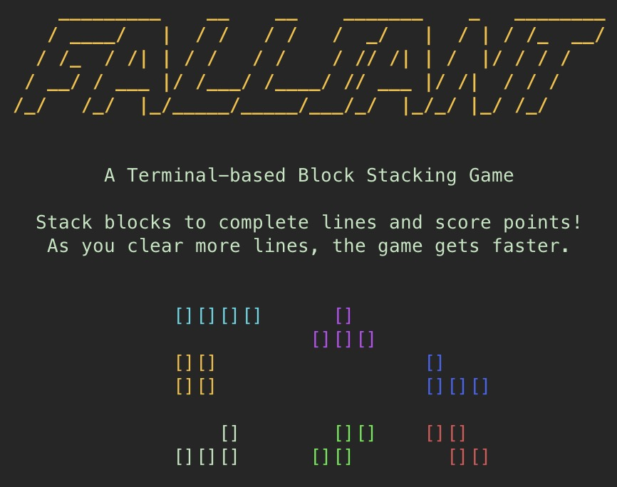

# Falliant

A terminal-based block stacking game inspired by classic block stacking games, written in Python using the curses library.



## Features

- Classic block-stacking gameplay
- Multiple starting levels with increasing difficulty
- Hold piece functionality
- Next piece preview
- Level progression system
- High score tracking with player initials
- Clean terminal UI with color support

## Requirements

- Python 3.6+
- A terminal that supports curses and colors (most modern terminals do)

## Installation

### Option 1: Install from PyPI

```bash
pip install falliant
```

### Option 2: Install from source

1. Clone or download this repository
2. Install directly:

```bash
# Install globally
pip install .

# Or install in user directory (no admin rights needed)
pip install --user .
```

### Option 3: Development setup with virtual environment

1. Clone or download this repository
2. Set up a virtual environment and install:

```bash
# Create and activate virtual environment
python -m venv venv
source venv/bin/activate  # On Windows: venv\Scripts\activate

# Install in development mode
pip install -e .
```

## How to Play

After installation, simply run:

```bash
falliant
```

If installed in development mode with a virtual environment, make sure the environment is activated before running the command.

### Controls

- **←, ↓, →** or **A, S, D**: Move block left, down, or right
- **↑** or **W**: Rotate block
- **Space**: Drop block to bottom
- **C**: Hold current block
- **P**: Pause/resume game
- **Q**: Quit to menu

### Game Rules

- Arrange falling blocks to create complete horizontal lines
- Completed lines will disappear and award points
- The game speeds up as you level up
- Level increases every 10 lines cleared
- The game ends when blocks stack up to the top of the board
- If you achieve a high score, you can enter your three-letter initials

### Scoring System

- 1 line: 40 × level
- 2 lines: 100 × level
- 3 lines: 300 × level
- 4 lines: 1200 × level (Falliant!)
- Top 10 high scores are tracked and saved locally

## Known Issues

- Terminal resizing during gameplay may cause display issues
- Some terminals might not display colors correctly

## Troubleshooting

If you encounter display issues:

1. Try running in a different terminal
2. Make sure your terminal supports curses and colors
3. Ensure your terminal is sized appropriately (at least 80×24)

## Development

### Contributing

To contribute to Falliant:

1. Fork the repository
2. Set up a virtual environment as described in the installation section
3. Make your changes
4. Submit a pull request

### Version Management

#### Version Numbering Scheme

We follow Semantic Versioning (SemVer):

- **MAJOR.MINOR.PATCH** (e.g., `1.0.1`)
  - **MAJOR**: Breaking changes
  - **MINOR**: New features, backwards compatible
  - **PATCH**: Bug fixes, documentation updates

#### Version Synchronization

The version number is synchronized across GitHub and PyPI through these rules:

- `pyproject.toml` is the source of truth for version numbers
- GitHub Releases/tags must match the version in `pyproject.toml`
- PyPI releases are only triggered by GitHub Releases
- The Bump Version workflow ensures all these stay in sync

#### Methods for Version Updates

1. **Automated Method (Preferred)**
   - Go to GitHub Actions
   - Select "Bump Version" workflow
   - Click "Run workflow"
   - Choose version type:
     - `patch`: Bug fixes (1.0.0 → 1.0.1)
     - `minor`: New features (1.0.0 → 1.1.0)
     - `major`: Breaking changes (1.0.0 → 2.0.0)
   - Review and merge the created pull request
   - After merge, create a GitHub Release to trigger PyPI publish

2. **Manual Method**

   ```bash
   # Update version in pyproject.toml
   git add pyproject.toml
   git commit -m "bump: version X.Y.Z → X.Y.Z"
   git push origin main

   # Create and push tag
   git tag -a vX.Y.Z -m "version X.Y.Z"
   git push origin vX.Y.Z
   ```

#### Release Process

1. **Pre-release Checklist**
   - All tests passing
   - Documentation updated
   - Version number updated in `pyproject.toml`
   - All changes committed and pushed

2. **Creating the Release**
   - Go to Releases page on GitHub
   - Click "Draft a new release"
   - Choose or create tag matching version (e.g., `vX.Y.Z`)
   - Fill in release details
   - Click "Publish release"

3. **Automated Publishing**
   The GitHub Actions workflow will automatically:
   - Build the package
   - Publish to PyPI using trusted publisher
   - Make the release available on PyPI

4. **Post-release Verification**
   - Check GitHub release page
   - Verify on PyPI
   - Test installation:

     ```bash
     python -m venv test_env
     source test_env/bin/activate  # On Windows: test_env\Scripts\activate
     pip install falliant==X.Y.Z
     falliant  # Test basic functionality
     ```

#### Important Notes

- Changes to workflow files (`.github/workflows/*`) don't require version bumps
- Documentation-only changes typically use a PATCH version bump
- PyPI releases only happen when GitHub Releases are created
- Always ensure GitHub Release tags match the version in `pyproject.toml`
- The Bump Version workflow helps maintain this synchronization automatically

### Project Structure

```bash
falliant/               # Project root
├── pyproject.toml      # Package configuration
├── README.md           # Documentation
├── LICENSE             # MIT License
├── MANIFEST.in         # Package manifest
├── .github/            # GitHub Actions workflows
├── falliant/           # Python package
│   ├── __init__.py     # Package initialization
│   ├── __main__.py     # Entry point
│   ├── block.py        # Block class
│   ├── constants.py    # Game constants
│   ├── game.py         # Game logic
│   ├── renderer.py     # Display functions
│   ├── ui.py           # User interface
│   └── images/         # Image assets
```

## License

This game is provided under the MIT License. See the LICENSE file for details.

---

Created by: [Henry Sowell](https://github.com/veteranbv)
